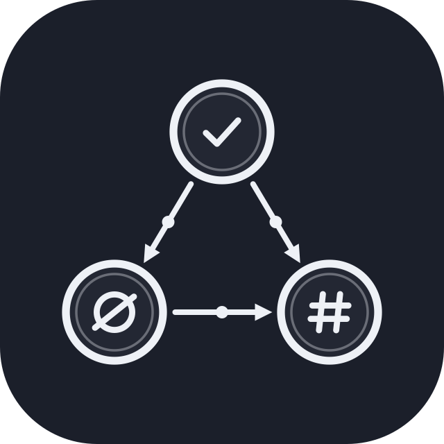
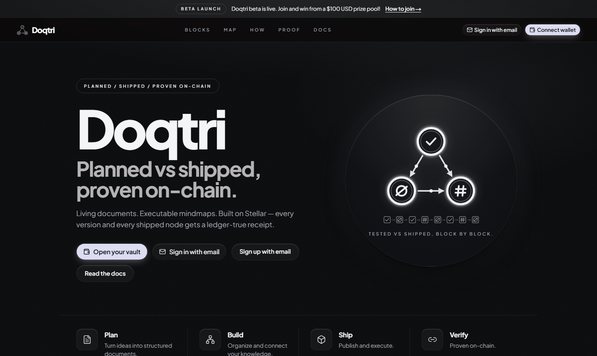

<p align="center">
  
</p>

<h1 align="center">Doqtri</h1>

<p align="center">
  <strong>Planned vs shipped, proven on-chain.</strong><br />
  Living documents → executable mindmaps → a ledger-true receipt on Stellar
</p>

<p align="center">
  Write your plan in markdown and its headings become a mindmap. Track every node from
  Planned to Verified, link it to the pull request that shipped it, and anchor every version's
  hash on <a href="https://stellar.org">Stellar</a> so anyone can check what was planned and what shipped.
</p>

<p align="center">
  <a href="https://www.doqtri.xyz"></a>
  <a href="https://www.doqtri.xyz/docs"></a>
  <a href="https://drive.google.com/file/d/1Fr_7cFn6m7hc4HesTbZ2Wlbp2i3bljXk/view?usp=sharing"></a>
  <a href="https://docs.google.com/presentation/d/14KDwpFrQ6QjlT4QC-vzjSss-0-tO6tocOBNSyBOhi8w/edit?usp=sharing"></a>
  <a href="https://x.com/usedoqtri"></a>
</p>

<p align="center">
  <a href="https://stellar.expert/explorer/testnet/contract/CCB5DFZRFFDCIBV5H5KWO6UCVN4ZXIPUSXONMBA6HVF433SPO7YEWMSB"></a>
  <a href="https://stellar.expert/explorer/public/contract/CCP5KFIWLUNPV2G7ATBKFMIZF54JYRC343P5JCTARC4PRTGM23IU6ET4"></a>
  <a href="./LICENSE"></a>
</p>

<p align="center">
  
  
  
  
  
  
  
</p>

<p align="center">
  <a href="https://www.doqtri.xyz"></a>
</p>

> **Beta is live.** Write a note on anything Web3, screenshot its mindmap and submit it at
> [doqtri.xyz/promo](https://www.doqtri.xyz/promo) for a share of the **$100 USD prize pool**.

---

## Contents

- [Try it in 30 seconds](#try-it-in-30-seconds)
- [Problem](#problem) · [Solution](#solution) · [Features](#features)
- [How verification works](#how-verification-works) · [Architecture](#architecture)
- [Deployed contracts](#deployed-contracts) · [Contract interface](#contract-interface)
- [Quick start: app](#quick-start--app-doqtrifrontend) · [Quick start: contract](#quick-start--contract)
- [Tech stack](#tech-stack) · [Repository layout](#repository-layout) · [CI](#ci)
- [User testing](#user-testing) · [Roadmap](#roadmap) · [License](#license)

## Try it in 30 seconds

1. Open **[doqtri.xyz](https://www.doqtri.xyz)** and sign up with email. No browser extension needed:
   a passkey (Face ID, fingerprint or device PIN) creates your Stellar wallet. Prefer Freighter?
   Use **Connect wallet** instead.
2. Click the template icon in the vault and pick one of 14 starters, such as a roadmap, grant
   proposal or sprint plan. Its headings become your mindmap instantly.
3. Hit **Save & anchor**. The note's hash is written to Stellar testnet, and its public audit page
   at `/d/[docId]` shows the receipt to anyone, logged in or not.

## Problem

Teams plan in living documents (Google Docs, Notion, markdown vaults), then ship the work in
n8n, Make, Retool, Langflow and scattered repos. That creates a trust gap:

- **Plans and reality diverge.** The doc says “done”; the workflow was never built.
- **Progress is unverifiable.** “Shipped” badges live in private app state anyone can edit.
- **No shared receipt.** Stakeholders can’t independently check which version of the plan was
  active, or which mindmap nodes actually went live.
- **Audit trails rot.** Screenshots and status meetings don’t survive handoffs, vendor churn, or
  “we’ll update the doc later.”

In short: **you can’t prove planned vs shipped.**

## Solution

**Doqtri** is Obsidian for executable plans, with Stellar as the proof layer.

| Layer | What it does |
| --- | --- |
| **Vault + editor** | Write the plan in markdown, or import a PDF/DOCX; headings compile into a mindmap |
| **Executable mindmap** | Each node tracks Planned → Building → Built → Verified |
| **Ship panel** | Link a node to the GitHub issue or PR (or n8n / Make / Retool / Langflow build) that shipped it |
| **DoqtriRegistry (Soroban)** | Anchors SHA-256 document hashes and node status on Stellar, with owner auth |
| **Public audit** | Anyone opens `/d/[docId]` and reads the history from the ledger, not from our database |

Every semantic change bumps an on-chain version; every shipped node leaves a receipt.

## Features

**Write and plan**
- Obsidian-style vault: markdown notes, `[[wikilinks]]`, a global graph and a per-note mindmap
- **Template gallery:** 14 starter notes (roadmaps, sprints, grant proposals, contract launches,
  research, postmortems…) with a live preview of each mindmap
- **Imports that never lose your file:** PDF/DOCX → markdown with live per-step progress,
  retries, and an “import without AI” fallback
- Rename and delete notes; anchored notes are protected from deletion

**Mindmap Studio**
- Themes (Monochrome, Neon Grid, Aurora, Blueprint, Paper…), fonts and layouts
- 3D view, PNG export, and focus mode that highlights and locks one branch

**Ship and prove**
- **Save & anchor:** one button registers or updates the note's hash on Stellar
- Link mindmap nodes to GitHub issues and pull requests; the PR's state suggests the node's status
- Version history with transaction receipts, and a public audit page per document

**Accounts and wallets**
- **Email sign-up with passkey wallets:** a Stellar smart wallet unlocked by Face ID, fingerprint
  or PIN, with backup passkeys; anchoring fees are relayed through a fee forwarder
- **Wallet sign-in** with Freighter and other Stellar wallets: a signed one-time challenge, not just an address
- XLM balance in the status bar and a pre-flight fee check before any wallet prompt
- Phone layout with a bottom tab bar, in the Monochrome Glass design

## How verification works

You don't have to trust Doqtri's database to check a claim:

1. Doqtri hashes the note's content (SHA-256) and the owner signs a `register_document` or
   `update_document` call on the DoqtriRegistry contract. Each update increments the version.
2. Node status changes (`Planned → Building → Built → Verified`) are written with
   `set_node_status`, including the tool and artifact reference.
3. Anyone can open the public audit page at `/d/[docId]`. It rebuilds the version history from
   the ledger and checks that the current content hash matches the anchored one.
4. Every entry links to its transaction on Stellar Expert, so the check doesn't depend on Doqtri.

What it proves: which version existed, when, and who signed it. It doesn't judge whether the
work itself is good.

## Architecture

```text
 Browser                                   Server (Next.js on Vercel)            Stellar (Soroban)
┌──────────────────────────┐   API    ┌──────────────────────────────┐        ┌────────────────────┐
│ Vault · editor · mindmap │────────► │ /api/* — notes, ingest (AI), │        │ DoqtriRegistry     │
│ Mindmap Studio · ship    │          │ GitHub links, audit reads    │        │  documents, nodes  │
│                          │          └──────────────┬───────────────┘        │  versions, events  │
│ Wallet signs the tx:     │                         │                        └─────────▲──────────┘
│  · Freighter / wallets   │──── signed transaction ─┼──────────────────────────────────┤
│  · passkey smart wallet ─┼──► relayer + FeeForwarder (fee-forwarder/) ───────────────┘
└──────────────────────────┘                         │
                                                     ▼
                                     Supabase: auth, documents (RLS), storage
 Public audit page /d/[docId]  ◄──── reads history straight from the ledger
```

## Deployed contracts

The live app at doqtri.xyz runs on **Stellar testnet**. The same contract is also deployed on
**mainnet**, where it was used for a 20-wallet production test; switching the app to mainnet is two
environment variables (see [Network selection](#network-selection)).

### Stellar Testnet (the live app)

| Field | Value |
| --- | --- |
| **Network** | Stellar Testnet |
| **Contract ID** | [`CCB5DFZRFFDCIBV5H5KWO6UCVN4ZXIPUSXONMBA6HVF433SPO7YEWMSB`](https://lab.stellar.org/r/testnet/contract/CCB5DFZRFFDCIBV5H5KWO6UCVN4ZXIPUSXONMBA6HVF433SPO7YEWMSB) |
| **CLI alias** | `doqtri` |
| **WASM hash** | `ef0124a4a22b60ba1f4e0e41823d31b175d90d38b1ba034970e58e0cf4e0e252` |

**Explorer links**

- [Open in Stellar Lab](https://lab.stellar.org/r/testnet/contract/CCB5DFZRFFDCIBV5H5KWO6UCVN4ZXIPUSXONMBA6HVF433SPO7YEWMSB)
- [Deploy transaction (Expert)](https://stellar.expert/explorer/testnet/tx/8b65276712032e15a2094b75c0818c5b87556b91782b9612ffad8836084d916a)
- [WASM upload transaction (Expert)](https://stellar.expert/explorer/testnet/tx/5da4263b7e01b3c5be44b093bc6105aec07f20e4157b5231516c980dd4933cbd)

### Stellar Mainnet

| Field | Value |
| --- | --- |
| **Network** | Stellar Public Network (mainnet) |
| **Contract ID** | [`CCP5KFIWLUNPV2G7ATBKFMIZF54JYRC343P5JCTARC4PRTGM23IU6ET4`](https://lab.stellar.org/r/mainnet/contract/CCP5KFIWLUNPV2G7ATBKFMIZF54JYRC343P5JCTARC4PRTGM23IU6ET4) |
| **WASM hash** | `6abac53e2306b09a13f6eb60649953305159ba293f8f97a2ab0720c6a26ad9af` |
| **Deployed** | 2026-07-30 |

**Explorer links**

- [Open in Stellar Lab](https://lab.stellar.org/r/mainnet/contract/CCP5KFIWLUNPV2G7ATBKFMIZF54JYRC343P5JCTARC4PRTGM23IU6ET4)
- [Contract on Stellar Expert](https://stellar.expert/explorer/public/contract/CCP5KFIWLUNPV2G7ATBKFMIZF54JYRC343P5JCTARC4PRTGM23IU6ET4)
- [WASM upload transaction](https://stellar.expert/explorer/public/tx/8977c7b74768fce80768116cfe3d7a4270519471b5d34ff113302c348de9b336)
- [Deploy transaction](https://stellar.expert/explorer/public/tx/9035158124d14a202347a990d9c3d1e63a844c35e64e2f46f3e3572ac801fbd2)

**What mainnet actually costs**

| Operation | Fee charged |
| --- | --- |
| WASM upload (one-time) | 8.0525 XLM |
| Deploy contract (one-time) | 0.0183 XLM |
| `register_document` | 0.055094 XLM |
| `set_node_status` | 0.048082 XLM |
| `update_document` | 0.000801 XLM |
| Full document lifecycle, per user | ~0.104 XLM |

The upload is expensive because the code entry's rent dominates it — about 17×
the testnet price, while a `register_document` write costs only ~1.5× testnet.
That rent expires: keep the code entry alive with
`stellar contract extend --wasm-hash <hash> --network mainnet --ledgers-to-extend <n>`.

## Contract interface

| Function | Auth | Description |
| --- | --- | --- |
| `register_document(owner, doc_id, content_hash)` | owner | Anchor a new document at version `1` |
| `update_document(doc_id, new_hash)` | owner | Anchor a new hash; returns incremented version |
| `set_node_status(doc_id, node_id, status, tool, artifact_ref)` | owner | Record node lifecycle |
| `get_document(doc_id)` | none | Read anchored document state |
| `get_node(doc_id, node_id)` | none | Read a node’s build record |

**Node statuses:** `Planned` · `Building` · `Built` · `Verified`

**Storage keys:** `DataKey::Doc(doc_id)` · `DataKey::Node(doc_id, node_id)`  
**TTL:** threshold 30 days → extend to 90 days on every write (`1 day = 17280` ledgers)

## Quick start — app (`doqtri/frontend`)

Prerequisites: Node 20+ and a Supabase project. An OpenAI key is only needed for AI imports.

```bash
cd doqtri/frontend
cp .env.example .env.local   # fill in the Supabase block at minimum
npm install
npm run dev
```

Open [http://localhost:3000](http://localhost:3000), sign up, and you land in the vault.

```bash
npm test          # unit tests (Vitest)
npm run lint
npm run build && npm run start
npm run test:e2e  # Playwright; needs real Supabase keys
```

| Variable | Needed for |
| --- | --- |
| `NEXT_PUBLIC_SUPABASE_URL`, `NEXT_PUBLIC_SUPABASE_ANON_KEY`, `SUPABASE_SERVICE_ROLE_KEY` | **Required.** Auth, notes, storage |
| `OPENAI_API_KEY` (`OPENAI_MODEL`, `AI_DAILY_LIMIT`) | AI import and regenerate |
| `NEXT_PUBLIC_NETWORK_PASSPHRASE`, `NEXT_PUBLIC_CONTRACT_ID` (+ RPC / Horizon URLs) | Choosing the network; defaults to the testnet contract |
| `DOQTRI_RELAYER_SECRET`, `CHANNELS_API_KEY` | Passkey wallets: the relayer that submits email users' writes |
| `GITHUB_TOKEN` | GitHub links on mindmap nodes (higher API rate limit) |
| `NEXT_PUBLIC_TURNSTILE_SITE_KEY` | Captcha on sign-up |
| `DOQTRI_ADMINS`, `CHAIN_*` limits | Admin pages and on-chain rate limits |

### Network selection

The frontend defaults to **testnet**. Two env vars flip it to mainnet — every
other network value (RPC, Horizon, explorer URLs) derives from the passphrase in
`doqtri/frontend/lib/stellar/config.ts`:

```bash
NEXT_PUBLIC_NETWORK_PASSPHRASE="Public Global Stellar Network ; September 2015"
NEXT_PUBLIC_CONTRACT_ID=CCP5KFIWLUNPV2G7ATBKFMIZF54JYRC343P5JCTARC4PRTGM23IU6ET4
```

The passphrase must match that string exactly, spaces around the `;` included;
anything else is treated as testnet. Setting the mainnet passphrase without a
contract ID throws at startup rather than silently falling back to the testnet
contract.

`NEXT_PUBLIC_*` values are inlined at build time, so changing them in the Vercel
dashboard has no effect until a new build runs — redeploy after editing them.

**Deploy (Vercel):** set the Root Directory to `doqtri/frontend` and add the variables above.
Database migrations live in `doqtri/backend/migrations/`.

## Quick start — contract

Prerequisites:

- Rust stable + `rustup target add wasm32v1-none`
- [Stellar CLI](https://developers.stellar.org/docs/tools/cli)

```bash
# from repo root
cargo test -p doqtri-registry

cd contract
stellar contract build
```

WASM (workspace layout):

`target/wasm32v1-none/release/doqtri_registry.wasm`

### Deploy (testnet)

```bash
# one-time identity
stellar keys generate alice --network testnet --fund

stellar contract deploy \
  --wasm ../target/wasm32v1-none/release/doqtri_registry.wasm \
  --source alice \
  --network testnet \
  --alias doqtri
```

### Deploy (mainnet)

Same command against `--network mainnet`, with a funded real account — budget
~8.1 XLM for the WASM upload (see the [mainnet fee table](#stellar-mainnet)). Simulate first; a
simulation is free and needs no key:

```bash
stellar contract deploy \
  --wasm ../target/wasm32v1-none/release/doqtri_registry.wasm \
  --source-account <YOUR_KEY> \
  --network mainnet
```

### Invoke (live contract)

```bash
CONTRACT=CCB5DFZRFFDCIBV5H5KWO6UCVN4ZXIPUSXONMBA6HVF433SPO7YEWMSB

stellar contract invoke \
  --id $CONTRACT --source alice --network testnet -- \
  register_document \
  --owner alice \
  --doc_id "doqtri-launch-plan" \
  --content_hash 0101010101010101010101010101010101010101010101010101010101010101

stellar contract invoke \
  --id $CONTRACT --source alice --network testnet -- \
  set_node_status \
  --doc_id "doqtri-launch-plan" \
  --node_id "node-weekly-report" \
  --status '"Built"' \
  --tool "n8n" \
  --artifact_ref "wf_8Xk2p"

stellar contract invoke \
  --id $CONTRACT --source alice --network testnet -- \
  get_document --doc_id "doqtri-launch-plan"
```

## Tech stack

| Layer | Package |
| --- | --- |
| Smart contracts | [soroban-sdk](https://crates.io/crates/soroban-sdk) `22`, Rust stable |
| Fee forwarder | OpenZeppelin `fee-forwarder-permissionless` pattern (`fee-forwarder/`) |
| CLI / deploy | [Stellar CLI](https://developers.stellar.org/docs/tools/cli) |
| Frontend | [Next.js](https://nextjs.org/) `16` + [React](https://react.dev/) `19`, Tailwind CSS `4` |
| Language | [TypeScript](https://www.typescriptlang.org/) |
| Chain client | [@stellar/stellar-sdk](https://www.npmjs.com/package/@stellar/stellar-sdk) `16` |
| Wallets | [@creit.tech/stellar-wallets-kit](https://www.npmjs.com/package/@creit.tech/stellar-wallets-kit) `2` (Freighter and others) + passkey smart wallets |
| Data and auth | [Supabase](https://supabase.com/) (Postgres + RLS, Auth, Storage) |
| Mindmaps | react-force-graph 2D / 3D |
| AI import | [OpenAI](https://www.npmjs.com/package/openai) |
| Testing | Vitest, Playwright, `cargo test` |
| Fonts | Plus Jakarta Sans · JetBrains Mono |

## Repository layout

```text
doqtri/                          # git repo root
├── doqtri/
│   ├── frontend/                # the app (Next.js vault, mindmaps, wallet, audit pages)
│   ├── backend/                 # Supabase migrations + AI prompts
│   ├── progress/                # feature plans (mindmap, passkey wallets, user-paid fees)
│   └── image/                   # brand assets
├── contract/                    # Soroban DoqtriRegistry
├── fee-forwarder/               # Soroban FeeForwarder for passkey-wallet fees
├── docs/                        # user testing, wallet integration, screenshots
├── .github/workflows/ci.yml
└── README.md
```

See also [`doqtri/README.md`](./doqtri/README.md) and [`doqtri/SPEC.md`](./doqtri/SPEC.md).

## CI

GitHub Actions (`.github/workflows/ci.yml`) runs four jobs:

1. **Contract tests:** `cargo test -p doqtri-registry`
2. **Build WASM:** `stellar contract build`, uploaded as an artifact
3. **App build + unit tests:** lint, Vitest and `next build`
4. **E2E (Playwright):** signs in and drives the vault against Supabase; runs on pushes to `main`

## User testing

| Round | Network | Testers | Transactions | Rating |
| --- | --- | -: | -: | -: |
| Product test | Testnet | 50 | 150 | 4.00 / 5 (survey) |
| Production test | Mainnet | 20 | 60 | — |

Every wallet, transaction and survey response is in **[docs/user-testing.md](./docs/user-testing.md)**,
and the original Freighter integration walkthrough is in
**[docs/stellar-wallet-integration.md](./docs/stellar-wallet-integration.md)**.
Raw responses: [onboarding survey](https://docs.google.com/spreadsheets/d/1szS0QGWCdsUu69XcxKGW3xFChVB3fri059fGxfEzCsA/edit?usp=sharing) ·
[mainnet feedback](https://docs.google.com/spreadsheets/d/1GUu0xxzByakSS_zG9otQRCnXqnVlt-cW_ytqngsmk5c/edit?usp=sharing).

## Roadmap

### Shipped since the first user tests

Every gap the 50 testnet testers reported is now closed:

- [x] Streaming imports with retries, a public audit page and ledger proof UI — [`b6783821`](https://github.com/armlynobinguar/doqtri/commit/b6783821)
- [x] Stable wallet sessions, XLM balance and a pre-flight funding check — [`cdd8efa8`](https://github.com/armlynobinguar/doqtri/commit/cdd8efa8)
- [x] Wallet sign-in requires a signature, not just an address — [`b7bcbfc5`](https://github.com/armlynobinguar/doqtri/commit/b7bcbfc5)
- [x] Documentation at `/docs` — [`0fd271d5`](https://github.com/armlynobinguar/doqtri/commit/0fd271d5)
- [x] Email sign-up alongside wallet sign-in — [`623e2186`](https://github.com/armlynobinguar/doqtri/commit/623e2186)
- [x] Passkey smart wallets for email accounts, with backup passkeys — [`e7454f7e`](https://github.com/armlynobinguar/doqtri/commit/e7454f7e), [`9133d8e0`](https://github.com/armlynobinguar/doqtri/commit/9133d8e0)
- [x] Mobile layout for phones and portrait tablets — [`c184b2ab`](https://github.com/armlynobinguar/doqtri/commit/c184b2ab)
- [x] GitHub issue and PR links on mindmap nodes — [`5286f090`](https://github.com/armlynobinguar/doqtri/commit/5286f090)
- [x] One Save & anchor button, plus rename and delete for notes — [`af40bec9`](https://github.com/armlynobinguar/doqtri/commit/af40bec9), [`00995ebe`](https://github.com/armlynobinguar/doqtri/commit/00995ebe), [`749f7291`](https://github.com/armlynobinguar/doqtri/commit/749f7291)
- [x] Mindmap Studio: themes, 3D view, PNG export, focus mode — [`fc600141`](https://github.com/armlynobinguar/doqtri/commit/fc600141)
- [x] Template gallery with 14 starter notes — [`4a7bad3f`](https://github.com/armlynobinguar/doqtri/commit/4a7bad3f)

### Next

- [ ] Vault export to a markdown zip, and undo for AI regenerate
- [ ] A demo vault anyone can read before signing up
- [ ] Batch node-status updates in one signed transaction
- [ ] Run the live app on mainnet, with fee estimates shown before every write

## License

[MIT](./LICENSE)
