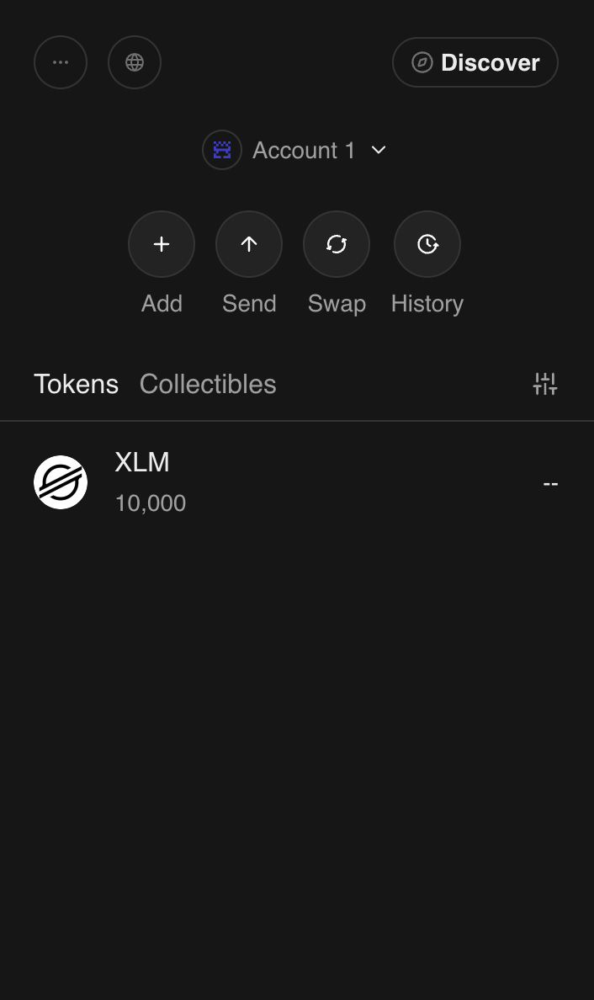
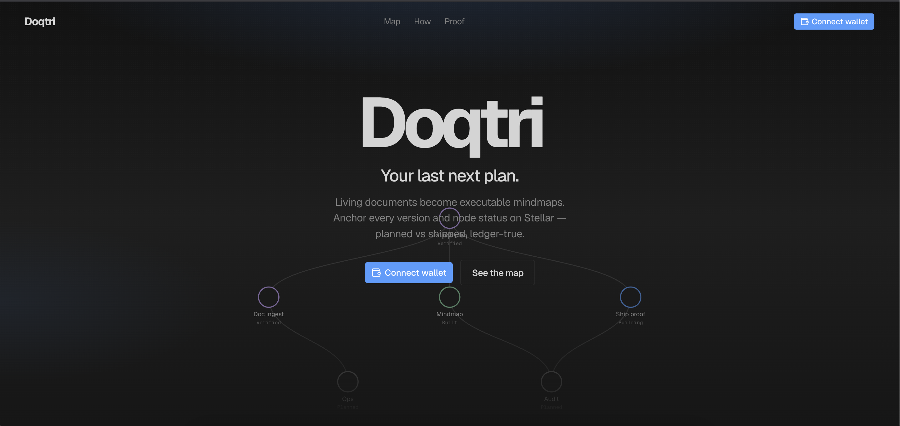
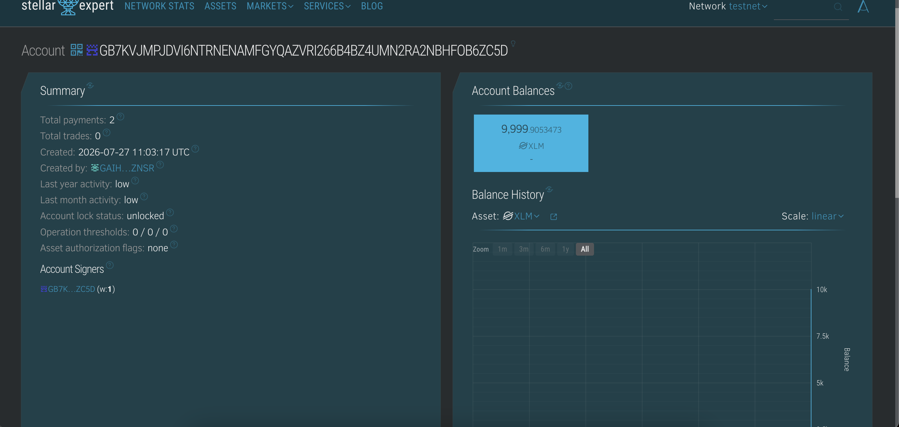
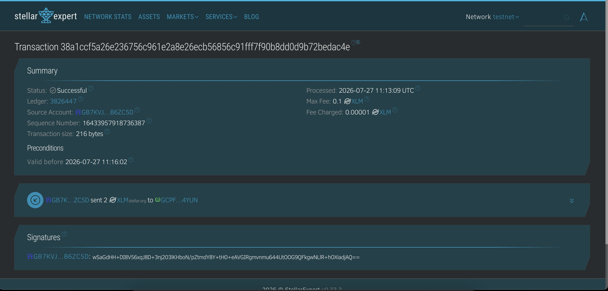

# Stellar wallet integration (testnet)

The original end-to-end wallet test: Freighter on testnet, connect, balance and a signed payment,
each verified on-chain. Kept as a record of the integration; the app has moved on since
(signature sign-in, an in-app XLM balance with a pre-flight fee check, and passkey wallets for
email accounts).

[← Back to README](../README.md)

### 1. Wallet setup

Freighter installed and switched to **Stellar Testnet**, account funded from
Friendbot with **10,000 XLM**.

| Field | Value |
| --- | --- |
| Network | Stellar Testnet |
| Account | [`GB7KVJMPJDVI6NTRNENAMFGYQAZVRI266B4BZ4UMN2RA2NBHFOB6ZC5D`](https://stellar.expert/explorer/testnet/account/GB7KVJMPJDVI6NTRNENAMFGYQAZVRI266B4BZ4UMN2RA2NBHFOB6ZC5D) |
| Created | 2026-07-27 11:03:17 UTC |
| Initial balance | 10,000 XLM |

### 2. Wallet connection

Connect and disconnect are implemented in the app via
[Stellar Wallets Kit](https://stellarwalletskit.dev/) pinned to `Networks.TESTNET`
(Freighter plus the other default modules).

| Behavior | Code |
| --- | --- |
| **Connect** — opens the wallet modal, returns the public key | `connectWallet()` in `doqtri/frontend/lib/wallet.ts` |
| Session exchange — public key → Supabase session | `doqtri/frontend/app/api/auth/wallet/route.ts` |
| Connect button + redirect to `/vault` | `doqtri/frontend/components/auth/login-form.tsx` |
| **Disconnect** — kit disconnect + Supabase sign-out | `disconnectWallet()` in `lib/wallet.ts`, called from `components/vault/settings-dialog.tsx` |
| Live address changes | `onWalletState()` (kit `STATE_UPDATED` event) |

The kit is imported lazily inside each function because it touches `localStorage`
during module evaluation, which breaks server rendering of client components.

### 3. Balance handling

The connected account's XLM balance, read from testnet Horizon and shown on
Stellar Expert after the transaction below:

**Balance after send:** `9,999.9053473 XLM` — 10,000 minus the 2 XLM payment and fees.

> **Status:** the balance is fetched and verified on-chain, but it is not yet
> rendered in the Doqtri UI — there is no balance component in
> `doqtri/frontend/` today. Wiring `@stellar/stellar-sdk` (already a dependency)
> to a Horizon `loadAccount` call and displaying it in the vault header is the
> remaining piece.

### 4. Transaction flow

A 2 XLM payment signed with Freighter on testnet:

| Field | Value |
| --- | --- |
| **Status** | ✅ Successful |
| **Transaction hash** | [`38a1ccf5a26e236756c961e2a8e26ecb56856c91fff7f90b8dd0d9b72bedac4e`](https://stellar.expert/explorer/testnet/tx/38a1ccf5a26e236756c961e2a8e26ecb56856c91fff7f90b8dd0d9b72bedac4e) |
| Ledger | 3826447 |
| Processed | 2026-07-27 11:13:09 UTC |
| Amount | 2 XLM |
| From → To | `GB7KVJ…B6ZC5D` → `GCPF…4YUN` |
| Fee charged | 0.00001 XLM |

> **Status:** the payment was built and signed through Freighter on testnet and
> confirmed on-chain. In-app send UI (amount form, pending spinner, success /
> failure state, hash link) is not implemented in `doqtri/frontend/` yet — the
> transaction-feedback pattern described under **Web app** above lives in the
> legacy `web/` frontend.
